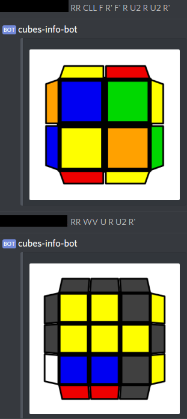

## cubes-info-bot ##

### What is this? When would I use it? ###

This program is a NodeJS Discord chatbot that sends back images of Rubik's cubes from Stachu's VisualCube in user-given states. As for use cases...



An example use case would be to show off some new algorithm you found, for example.

### How do I get started with it? ###

Check out [York's guide](https://anidiotsguide.gitbooks.io/discord-js-bot-guide/getting-started/windows-tldr.html)

Essentially:

- Clone this repository
- npm install
- Follow steps in York's guide above to make an app and bot account
- Make a config.json file. I've attached a sample one config_sample.json

Note: when you want to run the bot, type

```
node --harmony .
```

In the shell while in the directory where index.js resides

